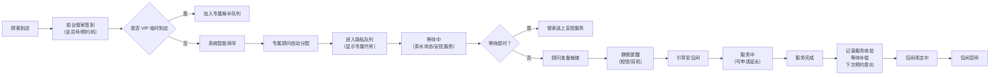

## 1. 产品概述

专为高端医美会所打造的私密化咨询师接诊排队系统，面向注重隐私的 VIP 客户、明星客户和高客单价项目顾客。通过接待区平板屏与内部调度端的协同，实现尊贵、私密、高效的接诊服务体验。

- 解决高端医美客户隐私保护需求，避免公开叫号暴露身份和项目信息
- 提升 VIP 客户尊享体验，通过专属代号、静默提醒、专属顾问等机制保障私密性
- 优化内部调度效率，实现智能排序、包间状态同步、服务记录全流程管理

## 2. 核心特性

### 2.1 用户角色

| 角色 | 登录方式 | 核心权限 |
|------|----------|----------|
| 前台管家 | 账号密码登录 | 贵宾签到、队列管理、静默提醒发送、安抚服务提示 |
| 咨询师 | 账号密码登录 | 查看分配顾客、申请延长时间、更新服务状态、填写服务记录 |
| 系统管理员 | 账号密码登录 | 顾问管理、包间配置、参数设置、数据统计 |
| VIP 客户 | 无登录（仅展示） | 接待区平板屏查看隐私队列状态 |

### 2.2 功能模块

1. **贵宾签到模块**：会员号/预约码签到、VIP 临时到店候补、顾客信息核实
2. **隐私队列模块**：专属代号展示、茶水状态、柔和状态提示、智能排序
3. **专属顾问分配模块**：自动分配、手动调整、指定咨询师优先级
4. **包间状态模块**：空闲/清洁中/医生待入场状态同步、预计等待时间
5. **静默提醒模块**：短信提醒、耳机提醒、不公开叫号机制
6. **服务记录模块**：接待体验记录、等待补偿、下次预约意向

### 2.3 页面详情

| 页面名称 | 模块名称 | 功能描述 |
|---------|----------|----------|
| 接待区排队屏 | 隐私队列展示 | 专属代号、茶水状态、顾问准备中/请稍候等柔和提示，无真实姓名和项目信息 |
| 接待区排队屏 | 当前服务展示 | 正在服务的包间状态、预计完成时间 |
| 内部调度端 - 签到 | 贵宾签到 | 输入会员号/预约码完成签到，支持 VIP 临时到店加入候补队列 |
| 内部调度端 - 队列管理 | 隐私队列管理 | 查看完整队列、调整顺序、触发静默提醒、安抚服务提示 |
| 内部调度端 - 顾问分配 | 专属顾问分配 | 自动/手动分配顾问、查看咨询师状态、处理延长申请 |
| 内部调度端 - 包间管理 | 包间状态管理 | 包间状态更新、清洁进度、医生入场提醒 |
| 内部调度端 - 服务记录 | 服务完成记录 | 填写接待体验、记录补偿措施、预约下次到店时间 |

## 3. 核心流程

## 4. 用户界面设计

### 4.1 设计风格

**整体定位**：高端奢华、私密优雅、简约克制

- **主色调**：深空灰 (#1A1A2E) 为主背景，搭配玫瑰金 (#D4A574) 作为点缀，米白 (#F5F0E8) 作为文本色
- **辅助色**：雾霾蓝 (#4A6670) 用于状态标识，抹茶绿 (#7D8471) 用于成功状态，暖金 (#C9A961) 用于 VIP 标识
- **字体**：标题采用优雅衬线字体（如 Noto Serif SC），正文采用纤细无衬线字体（如 Noto Sans SC Light）
- **按钮风格**：无边框极简设计，底部细线装饰，悬停时微妙的光泽渐变
- **布局风格**：大量留白，不对称布局，卡片式分层设计，柔和阴影
- **图标风格**：线性极简图标，统一 1px 线宽，玫瑰金色系
- **动效**：缓慢的渐入渐出，柔和的呼吸灯效果，避免任何突兀动画

### 4.2 页面设计概览

| 页面名称 | 模块名称 | UI 元素 |
|---------|----------|---------|
| 接待区排队屏 | 隐私队列展示 | 竖屏布局，大号专属代号，柔和状态标签，茶水图标，动态时钟，品牌 logo 水印，低饱和度背景纹理 |
| 接待区排队屏 | 包间状态展示 | 包间卡片，状态指示灯（呼吸效果），预计时间倒计时 |
| 内部调度端 - 签到 | 签到表单 | 大尺寸输入框，会员信息预览卡片，VIP 标识，快捷签到按钮 |
| 内部调度端 - 队列管理 | 队列列表 | 可拖拽排序，顾客等级标签，等待时长计时器，静默提醒快捷按钮 |
| 内部调度端 - 顾问分配 | 顾问状态 | 咨询师在线状态，当前负荷，专业领域标签，分配历史 |
| 内部调度端 - 包间管理 | 包间看板 | 状态色标，清洁进度条，医生头像占位，预计空闲时间 |
| 内部调度端 - 服务记录 | 记录表单 | 星级评分，多选项补偿措施，日期选择器，备注文本域 |

### 4.3 响应式设计

- **桌面端优先**：内部调度端采用桌面端设计，适配 1920×1080 及以上分辨率
- **平板适配**：接待区排队屏针对 10-12 寸平板竖屏模式优化，触控友好
- **触控优化**：所有可点击区域 ≥ 48×48px，重要按钮尺寸 ≥ 60×60px，适合平板操作

## 5. 隐私保护设计要点

1. **专属代号机制**：每位顾客签到后自动生成随机专属代号（如「紫罗兰」「月光石」「金丝雀」），全程不显示真实姓名
2. **项目脱敏**：排队屏不显示任何项目信息，仅咨询师端可见
3. **静默提醒**：默认关闭公开叫号，采用短信或管家蓝牙耳机提醒
4. **屏幕防窥**：接待区屏幕采用大角度倾斜设计，仅正面可见，队列信息不显示完整列表
5. **数据加密**：会员信息本地加密存储，界面显示时自动脱敏处理
