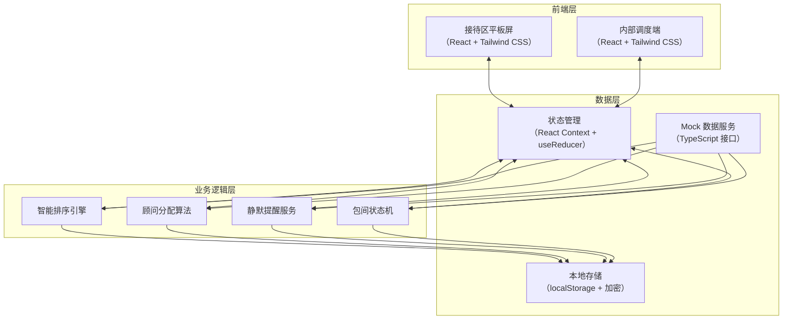
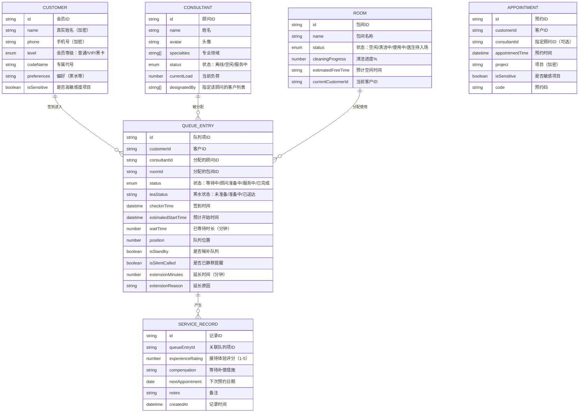

## 1. 架构设计



## 2. 技术说明

- **前端框架**：React@18 + TypeScript
- **构建工具**：Vite@5
- **样式方案**：Tailwind CSS@3
- **路由管理**：React Router@6
- **状态管理**：React Context + useReducer（轻量级全局状态）
- **图标库**：Lucide React（线性极简图标）
- **日期处理**：date-fns
- **数据持久化**：localStorage（加密存储敏感信息）
- **后端服务**：无（采用本地 Mock 数据模拟后端接口）
- **数据库**：无（使用 TypeScript 定义数据模型 + Mock 数据）

## 3. 路由定义

| 路由 | 用途 | 访问权限 |
|------|------|----------|
| /reception | 接待区平板屏 - 隐私队列展示 | 公开（无需登录） |
| /dashboard | 内部调度端 - 首页看板 | 需登录 |
| /dashboard/checkin | 贵宾签到模块 | 前台管家/管理员 |
| /dashboard/queue | 隐私队列管理 | 前台管家/管理员 |
| /dashboard/consultants | 专属顾问分配 | 管理员 |
| /dashboard/rooms | 包间状态管理 | 全体工作人员 |
| /dashboard/records | 服务记录 | 咨询师/管理员 |
| /dashboard/settings | 系统设置 | 管理员 |
| /login | 登录页面 | 公开 |

## 4. 数据模型

### 4.1 实体关系图



### 4.2 核心数据结构定义

```typescript
// 客户等级
export type CustomerLevel = 'NORMAL' | 'VIP' | 'BLACK_CARD';

// 队列状态
export type QueueStatus = 'WAITING' | 'CONSULTANT_PREPARING' | 'IN_SERVICE' | 'COMPLETED';

// 包间状态
export type RoomStatus = 'IDLE' | 'CLEANING' | 'IN_USE' | 'DOCTOR_PENDING';

// 顾问状态
export type ConsultantStatus = 'OFFLINE' | 'IDLE' | 'IN_SERVICE';

// 茶水状态
export type TeaStatus = 'NOT_PREPARED' | 'PREPARING' | 'DELIVERED';

// 提醒方式
export type ReminderMethod = 'SMS' | 'HEADSET' | 'NONE';

export interface Customer {
  id: string;
  name: string;
  phone: string;
  level: CustomerLevel;
  codeName: string;
  teaPreference: string;
  isSensitive: boolean;
  avatar?: string;
}

export interface Consultant {
  id: string;
  name: string;
  avatar: string;
  specialties: string[];
  status: ConsultantStatus;
  currentLoad: number;
  rating: number;
}

export interface Room {
  id: string;
  name: string;
  status: RoomStatus;
  cleaningProgress: number;
  estimatedFreeTime?: Date;
  currentQueueEntryId?: string;
}

export interface QueueEntry {
  id: string;
  customerId: string;
  consultantId?: string;
  roomId?: string;
  status: QueueStatus;
  teaStatus: TeaStatus;
  checkinTime: Date;
  estimatedStartTime?: Date;
  waitTime: number;
  position: number;
  isStandby: boolean;
  isSilentCalled: boolean;
  extensionMinutes: number;
  extensionReason?: string;
  reminderMethod: ReminderMethod;
  appointmentId?: string;
  designatedConsultantId?: string;
}

export interface Appointment {
  id: string;
  customerId: string;
  consultantId?: string;
  appointmentTime: Date;
  project: string;
  isSensitive: boolean;
  code: string;
  status: 'PENDING' | 'CHECKED_IN' | 'CANCELLED';
}

export interface ServiceRecord {
  id: string;
  queueEntryId: string;
  customerId: string;
  consultantId: string;
  experienceRating: number;
  compensation: string[];
  nextAppointmentDate?: Date;
  notes: string;
  createdAt: Date;
}

export interface SystemSettings {
  maxWaitTime: number;
  autoAssignConsultant: boolean;
  defaultReminderMethod: ReminderMethod;
  queueDisplayCount: number;
  codeNamePool: string[];
}
```

## 5. 核心算法说明

### 5.1 智能排序引擎

排序优先级（从高到低）：
1. **会员等级**：黑卡 > VIP > 普通
2. **是否指定顾问**：指定顾问优先
3. **项目敏感度**：高敏感度项目优先
4. **预约时间**：预约时间早者优先
5. **签到时间**：签到时间早者优先
6. **是否候补**：预约客户优先于临时候补

```typescript
const sortQueue = (entries: QueueEntry[], customers: Customer[], appointments: Appointment[]): QueueEntry[] => {
  const levelWeight = { BLACK_CARD: 100, VIP: 50, NORMAL: 10 };
  
  return [...entries].sort((a, b) => {
    const customerA = customers.find(c => c.id === a.customerId)!;
    const customerB = customers.find(c => c.id === b.customerId)!;
    const aptA = appointments.find(ap => ap.id === a.appointmentId);
    const aptB = appointments.find(ap => ap.id === b.appointmentId);
    
    let scoreA = levelWeight[customerA.level];
    let scoreB = levelWeight[customerB.level];
    
    if (a.designatedConsultantId) scoreA += 30;
    if (b.designatedConsultantId) scoreB += 30;
    
    if (customerA.isSensitive) scoreA += 25;
    if (customerB.isSensitive) scoreB += 25;
    
    if (aptA) scoreA += 15;
    if (aptB) scoreB += 15;
    
    if (a.isStandby) scoreA -= 20;
    if (b.isStandby) scoreB -= 20;
    
    if (scoreA !== scoreB) return scoreB - scoreA;
    
    return a.checkinTime.getTime() - b.checkinTime.getTime();
  });
};
```

### 5.2 顾问自动分配算法

分配策略：
1. 优先分配客户指定的顾问
2. 选择当前负荷最低的空闲顾问
3. 匹配顾问专业领域与客户项目
4. 考虑历史服务记录（回头客优先分配原顾问）

## 6. 目录结构

```
src/
├── assets/              # 静态资源（字体、图片）
├── components/          # 公共组件
│   ├── layout/         # 布局组件
│   ├── queue/          # 队列相关组件
│   ├── room/           # 包间相关组件
│   ├── consultant/     # 顾问相关组件
│   └── ui/             # 基础UI组件
├── contexts/           # React Context 状态管理
│   ├── QueueContext.tsx
│   ├── AuthContext.tsx
│   └── SettingsContext.tsx
├── data/               # Mock 数据
│   ├── mockCustomers.ts
│   ├── mockConsultants.ts
│   ├── mockRooms.ts
│   └── mockAppointments.ts
├── hooks/              # 自定义 Hooks
│   ├── useQueue.ts
│   ├── useTimer.ts
│   └── useEncryption.ts
├── pages/              # 页面组件
│   ├── reception/      # 接待区平板屏
│   ├── dashboard/      # 内部调度端
│   └── login/          # 登录页
├── types/              # TypeScript 类型定义
│   └── index.ts
├── utils/              # 工具函数
│   ├── sortEngine.ts
│   ├── assignment.ts
│   ├── codeName.ts
│   └── encryption.ts
├── App.tsx
├── main.tsx
└── index.css
```

## 7. 隐私安全设计

1. **本地数据加密**：使用 AES 对 localStorage 中的客户姓名、手机号等敏感信息加密存储
2. **界面脱敏**：接待区屏幕不显示任何真实姓名、手机号、项目信息
3. **专属代号生成**：签到时自动从预设词库中随机分配专属代号，如「紫罗兰」「月光石」「金丝雀」
4. **路由守卫**：内部调度端所有页面需登录验证
5. **自动锁屏**：调度端闲置 5 分钟后自动返回登录页
